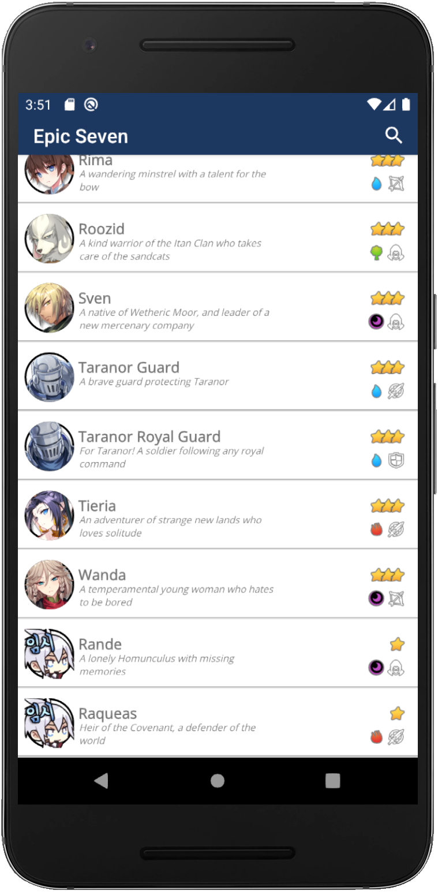

# Android Project - Epic Seven (Java)

## Introduction

Android Project - Epic Seven is a mobile application based on the mobile game Epic Seven. 
The purpose of this mobile application is to display a list of heroes and their characteristics such as their history, rarity, type, zodiac, relationships, etc.
This application can be used as a database where the most curious players can discover the history of their favorite characters.

  Designed using the Rest API EpicSevenDB. Here you will find links to the project and documentation.
- [GitHub](https://github.com/EpicSevenDB/api)
- [Swagger](https://api.epicsevendb.com/)

---

## Features

The project includes the use of several technical features and methods. So here is a list of what was used while coding the application.
- [RecyclerView](https://developer.android.com/guide/topics/ui/layout/recyclerview)
- [Gitflow](https://www.atlassian.com/fr/git/tutorials/comparing-workflows/gitflow-workflow)
- [Retrofit](https://square.github.io/retrofit/)
- [Rest API](https://www.astera.com/fr/type/blog/rest-api-definition/)
- [SharedPreferences](https://developer.android.com/reference/android/content/SharedPreferences?hl=en)
- [Picasso](https://github.com/square/picasso)
- [Android YouTube Player](https://github.com/PierfrancescoSoffritti/android-youtube-player)
- [Search Interface](https://developer.android.com/training/search/setup)
- [Parcelable](https://developer.android.com/reference/android/os/Parcelable)
- [App Icon](https://developer.android.com/studio/write/image-asset-studio)
- [MVC Architecture](https://medium.com/upday-devs/android-architecture-patterns-part-1-model-view-controller-3baecef5f2b6)
- [Pop Up](https://developer.android.com/reference/android/app/Activity)
- [SOLID Principles](https://www.baeldung.com/solid-principles)
- [ReadMe](https://github.com/Simplonline-foad/utiliser-markdown/blob/master/README.md)

---

## Implementations

several features have been implemented within this application.
- Screen with a list of items
- Screen with the detail of an element
- WebService call to a Rest API
- Cached data storage
- Search for an item
- Pop Up
- Application Icon
- MVC Architecture
- Singleton
- Gitflow
- Design
- Unit Test
- SOLID Principles
- ReadMe

---

## How the mobile app works ? 

### First Activity: List of heroes

> When launching the application, the list of heroes is displayed.
> You can then slide down to discover the different heroes.
> we thus find the name, a small summary, the rarity, the element and the zodiac sign associated with the current hero.

 

> Sometimes a hero appears in the database, but his information has not yet been revealed to the public, so you can only know some information about him.
> A default icon is assigned to them and a pop up appears when we try to click on it.

 

> the search bar implementation allows you to easily search and find your heroes.
> It is done by following letter detection.
> If the hero has no information, the pop up still works.

 

 

### Second Activity: Hero Information  

> The Hero Information activity gathers information concerning the hero chosen previously in the List of Heroes activity.
> You have access to the story of the hero, his rarity, his element, his zodiac sign, his sentence, his relationships and a YouTube video trailer to illustrate his abilities in the game.
> A YouTube video has been set by default if there is no hero video.

 

 

---

## Changelog
> ### v0.0.3 (16/05/2020)  
>
> - Added ReadMe
> - Added MVC Architecture
> - Added Singleton
> - Added Pop up
> - Added Application Icon
> - Added SOLID Principles
> - Added Unit Test
> ----------
>
> ### v0.0.2 (02/05/2020)  
>
> - Added YouTube trailer for each hero 
>  
> ----------
>
> ### v0.0.1 (01/05/2020)
> 
> - Added Displaying a hero list  
> - Added Displaying hero Picture  
> - Added Displaying hero Story  
> - Added Displaying hero stats  
> - Added YouTube Player trailer for hero skills  
> - Added Search feature to search hero by name  

